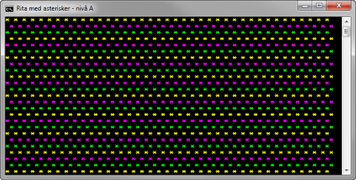
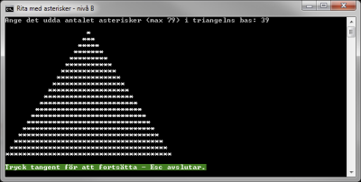
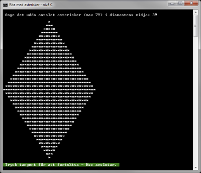

# Rita med asterisker (A-, B- och C-nivå)

Skriv ett program som åstadkommer skärmmönster enligt följande exempelfigurer för kravnivå A, B eller C på uppgiften. __Utmana dig själv för att ta dig till uppgiftens C-nivå!__

- [Uppgiftsbeskrivning på A-nivå:](a-niva/)

Figur 1: Kravnivå A

- [Uppgiftsbeskrivning på B-nivå:](b-niva/)

Figur 2: Kravnivå B

- [Uppgiftsbeskrivning på C-nivå:](c-niva/)

Figur 3: Kravnivå C