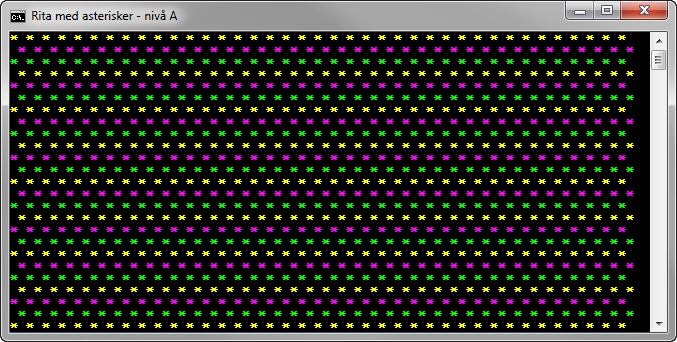

# Rita med asterisker - nivå A

## Problem

Skriv ett program som skapar ett olikfärgat mönster enligt figur A.1 nedan.

## A-Krav

1. Figuren ska bestå av 25 rader och 39 kolumner med asterisktecken.
2. Varannan rad ska vara inskjuten med ett mellanslag.
3. Radernas färger ska alternera mellan gul, magenta och grön.
4. För utskriften får du endast använda följande satser, högst en gång vardera: 

```c#
Console.Write(" ");
Console.Write("* ");
Console.WriteLine();
```

___Konsollfönster___

En körning av programmet enligt nämnda förutsättningar ska resultera i en utskrift likt bilden nedan.



Figur A.1. Konsollutskrift från programmet.

## Tips

Läs om:

+ variabler
	+ Essential C# 6.0, 13-17.
	+ https://msdn.microsoft.com/en-us/library/hh147285(VS.88).aspx#Variables	
+ ”for”-satsen
	+ Essential C# 6.0, 137-140.
	+ https://msdn.microsoft.com/en-us/library/ch45axte.aspx
+ ”if”-satsen
	+ Essential C# 6.0, 111-118.
	+ https://msdn.microsoft.com/en-us/library/5011f09h.aspx
+ ”switch”-satsen
	+ Essential C# 6.0, 143-146.
	+ https://msdn.microsoft.com/en-us/library/06tc147t.aspx
+ %-operatorn
	+ Essential C# 6.0, 91-92.
	+ https://msdn.microsoft.com/en-us/library/0w4e0fzs.aspx
+ Hantering av färger i ett konsolfönster
	+ https://msdn.microsoft.com/en-us/library/yae1s0f9.aspx
	+ https://msdn.microsoft.com/en-us/library/s66hf68a.aspx
	+ https://msdn.microsoft.com/en-us/library/d3zkyxxe.aspx

[Lösning](losning/)
