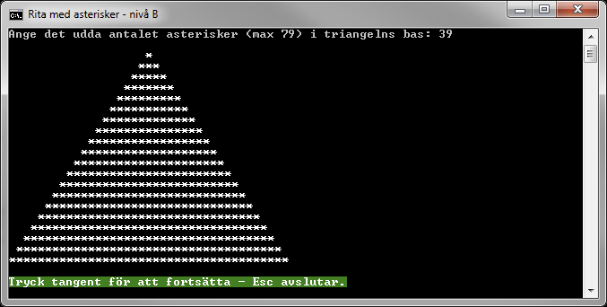

# Rita med asterisker - nivå B

## Problem

Skriv ett program för att i konsollfönstret skapa en triangel enligt figur B.1, där användaren ska kunna bestämma det udda antalet asterisker i triangelns bas. När triangeln har ritats ut ska användaren kunna välja att avsluta programmet genom att trycka på Escape-tangenten. Trycks någon annan tangent ner ska användaren på nytt kunna mata in antalet asterisker som triangelns bas ska bestå av. Programmet får endast använda följande satser, en gång vardera, för utskriften:

```c#
Console.Write(" ");
Console.Write("*");
Console.WriteLine();
``` 

Tabell B-1.

___Konsollfönster___

En körning av programmet enligt givna B-krav ska resultera i en utskrift likt följande bild.



Figur B.1. Konsollutskrift från programmet.

Programmet ska delas upp i de tre privata statiska metoder som återfinns i klassdiagrammet i figur B.2:


Figur B.2. Programklassens medlemsmetoder.

___Main___

```Main``` ska anropa metoderna ```ReadOddByte``` och ```RenderTriangle```. Anropen ska placeras i en ```do-while```-sats som avslutas då användaren trycker på Escape-tangenten.

___ReadOddByte___

Denna metod ska returnera ett udda heltal av typen ```byte```, dvs. det antal asterisker som användaren önskar att triangelns bas ska innehålla. Metoden ska säkerställa att inget felaktigt matas in, genom att kontrollera att inmatat värde är ett udda heltal inom det slutna intervallet från 1 till 79. Matar användaren in något som inte uppfyller dessa villkor ska ett felmeddelande visas, se figur B.3, varefter en ny inmatning ska kunna göras. För att fånga och hantera eventuella undantag som kastas vid inmatning av ogiltiga värden, måste metoden även innehålla en ”try-catch”-sats.


Figur B.3.

___RenderTriangle___

Metoden ```RenderTriangle``` ska ha parametern ```cols```, vilken ger antalet asterisker som triangelns bas ska innehålla. Med hjälp av nästlade ```for```-satser och utskriftssatserna i tabell B-1, vilka bara får användas en gång vardera, ska metoden rendera ut en triangel i konsollfönstret.

## B-Krav

1. Programmet ska erbjuda användaren att skapa nya trianglar tills denne väljer att avsluta programmet genom att trycka på Escape-tangenten.
2. Användaren ska bestämma hur många asterisker triangelns bas ska ha.
3. Antalet asterisker i triangelns bas måste ligga i det slutna intervallet från 1 till 79. Om felaktiga värden matas in ska felmeddelande visas och användaren erbjudas ett nytt inmatningsförsök.
4. Värdet för maximalt antal asterisker och samtliga strängar ska deklareras som namngivna konstanter.
5. Lösningen ska implementeras enligt givet klassdiagram i figur B.2 samt tillhörande beskrivning av respektive medlemsmetod.

## Tips

Läs om:

+ ”if”-satsen
	+ Essential C# 6.0, 111-118.
	+ https://msdn.microsoft.com/en-us/library/5011f09h.aspx
+ ”for”-satsen
	+ Essential C# 6.0, 137-140.
	+ https://msdn.microsoft.com/en-us/library/ch45axte.aspx
+ ”while”-satsen
	+ Essential C# 6.0, 134-137.
	+ https://msdn.microsoft.com/en-us/library/ch45axte.aspx
+ ”do-while”-satsen
	+ Essential C# 6.0, 134-137.
	+ https://msdn.microsoft.com/en-us/library/370s1zax.aspx
+ %-operatorn
	+ Essential C# 6.0, 91-92.
	+ https://msdn.microsoft.com/en-us/library/0w4e0fzs.aspx
+ Metoder
	+ Essential C# 6.0, 161-174.
	+ https://msdn.microsoft.com/en-us/library/ms173114.aspx
+ Undantag
	+ Essential C# 6.0, 202-209
	+ Essential C# 6.0, 433-441
	+ https://msdn.microsoft.com/en-us/library/0yd65esw.aspx
	+ https://msdn.microsoft.com/en-us/library/1ah5wsex.aspx
	+ https://msdn.microsoft.com/en-us/library/ww58ded5.aspx
+ Hantering av färger i ett konsolfönster
	+ https://msdn.microsoft.com/en-us/library/yae1s0f9.aspx
	+ https://msdn.microsoft.com/en-us/library/s66hf68a.aspx
	+ https://msdn.microsoft.com/en-us/library/d3zkyxxe.aspx

[Lösning](losning/)
