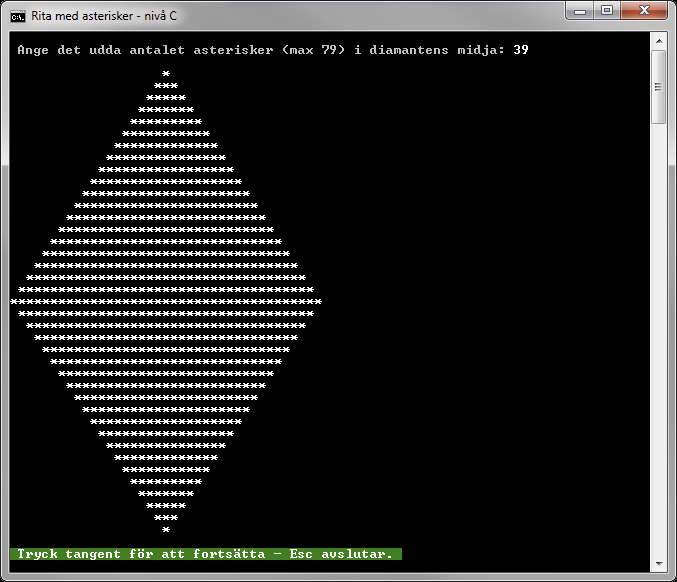
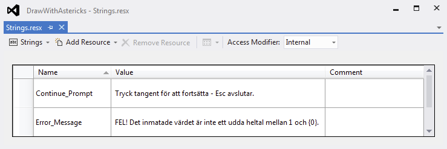
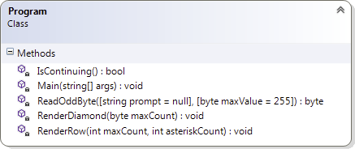
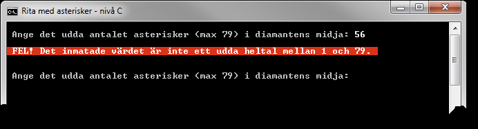

# Rita med asterisker - nivå C

## Problem

Skriv ett program för att i konsollfönstret skapa en "diamant" enligt figur C.1, där användaren ska kunna bestämma det udda antalet asterisker i diamantens midja. När diamanten har ritats ut ska användaren kunna välja att avsluta programmet genom att trycka på Escape-tangenten. Trycks någon annan tangent ner ska användaren på nytt kunna mata in antalet asterisker som diamantens midja ska innehålla. Programmet får endast använda följande satser, en gång vardera, för utskriften:

```c#
Console.Write(" ");
Console.Write("*");
Console.WriteLine();
``` 

Tabell C-1.

___Konsollfönster___

En körning av programmet enligt givna B-krav ska resultera i en utskrift likt följande bild.



Figur C.1. Konsollutskrift från programmet.

Textmeddelanden till användaren ska hanteras med hjälp av en resursfil. Figur C.2 är ett exempel på en resursfil med strängar.



Figur C.2.

Programmet ska delas upp i de fyra privata statiska metoder som återfinns i klassdiagrammet i figur C.3.



Figur C.3. Programklassens medlemsmetoder.

___Main___

```Main``` ska anropa metoderna ```ReadOddByte```, ```RenderDiamond``` och ```IsContinuing```. Anropen ska placeras i en ```do-while```-sats som avslutas då metoden ```IsContinuing``` returnerar ```false```, vilket ska ske då användaren trycker på Escape-tangenten.

Då ```ReadOddByte``` anropas ska det första argumentets värde hämtas från strängresursen. Det andra argumentets värde ska utgöras av en namngiven konstant som bestämmer det maximala antalet asterisker diamantens midja kan innehålla. Aktuella standardvärden får inte användas som argument vid anropet.

Det udda heltal av typen ```byte```, som returneras av ```ReadOddByte```, ska användas som argument vid anropet av ```RenderDiamond```.

___IsContinuing___

Uppgiften för denna metod är att presentera ett meddelande som uppmanar användaren att trycka på en tangent för att fortsätta, eller Escape-tangenten för att avsluta programmet. Om Escape-tangenten väljs ska metoden returnera ```false```; alla övriga tangenter ska leda till att ```true``` returneras.

___ReadOddByte___

Denna metod ska returnera ett udda heltal av typen ```byte```, dvs. det antal asterisker som användaren önskar att triangelns midja ska innehålla. Parametrarna ska tilldelas standardvärden, vilka ska användas om metoden anropas och argument saknas för den ena, eller båda parametrarna.

Metoden ska säkerställa att inget felaktigt matas in, genom att kontrollera att inmatat värde är ett udda heltal inom det slutna intervallet från 1 till det värde som parametern ```maxValue``` har. Matar användaren in något som inte uppfyller dessa villkor ska ett felmeddelande visas, se figur C.4, varefter en ny inmatning ska kunna göras. För att lösa detta måste metoden även hantera eventuella undantag som kastas vid inmatning av ogiltiga värden, med hjälp av en lämpligt applicerad ```try-catch```-konstruktion.



Figur C.4.

___RenderDiamond___

Metoden har parametern ```maxCount```, vilken ger antalet asterisker som diamantens midja ska innehålla. Genom användning av ```for```-satser och upprepade anrop av ```RenderRow``` ska metoden rendera ut en diamant rad för rad med asterisker i konsollfönstret.

___RenderRow___

Med användning av värdena från parametrarna ```maxCount``` och ```asteriskCount``` samt utskriftssatserna i tabell C-1 (vilka bara får skrivas en gång vardera) ska metoden rendera ut en rad med mellanslag och asterisker.

## C-Krav

1. Programmet ska erbjuda användaren att skapa nya diamanter tills denne väljer att avsluta programmet genom att trycka på Escape-tangenten.
2. Användaren ska bestämma hur många diamantens midja ska ha.
3. Antalet asterisker i diamantens midja ska ligga i det slutna intervallet från 1 till 79. Om felaktiga värden matas in ska felmeddelande visas och användaren erbjudas ett nytt inmatningsförsök.
4. Värdet för maximalt antal asterisker ska deklareras som en namngiven konstant.
5. Inga strängar får deklareras direkt i källkoden utan ska vara placerade i en strängresurs.
6. Lösningen ska implementeras enligt givet klassdiagram i figur C.3 samt tillhörande beskrivning av respektive medlemsmetod.

## Tips

Läs om:

+ ”if”-satsen
	+ Essential C# 6.0, 111-118.
	+ https://msdn.microsoft.com/en-us/library/5011f09h.aspx
+ ”for”-satsen
	+ Essential C# 6.0, 137-140.
	+ https://msdn.microsoft.com/en-us/library/ch45axte.aspx
+ ”while”-satsen
	+ Essential C# 6.0, 134-137.
	+ https://msdn.microsoft.com/en-us/library/ch45axte.aspx
+ ”do-while”-satsen
	+ Essential C# 6.0, 134-137.
	+ https://msdn.microsoft.com/en-us/library/370s1zax.aspx
+ %-operatorn
	+ Essential C# 6.0, 91-92.
	+ https://msdn.microsoft.com/en-us/library/0w4e0fzs.aspx
+ Metoder
	+ Essential C# 6.0, 161-174.
	+ https://msdn.microsoft.com/en-us/library/ms173114.aspx
+ Metoder med frivilliga argument
	+ Essential C# 6.0, 197-201
	+ https://msdn.microsoft.com/en-us/library/dd264739.aspx
+ Undantag
	+ Essential C# 6.0, 202-209
	+ Essential C# 6.0, 433-441
	+ https://msdn.microsoft.com/en-us/library/0yd65esw.aspx
	+ https://msdn.microsoft.com/en-us/library/1ah5wsex.aspx
	+ https://msdn.microsoft.com/en-us/library/ww58ded5.aspx
+ Hantering av färger i ett konsolfönster
	+ https://msdn.microsoft.com/en-us/library/yae1s0f9.aspx
	+ https://msdn.microsoft.com/en-us/library/s66hf68a.aspx
	+ https://msdn.microsoft.com/en-us/library/d3zkyxxe.aspx
+ Resurser
	+ https://msdn.microsoft.com/en-us/library/9za7fxc7.aspx

[Lösning](losning/)
